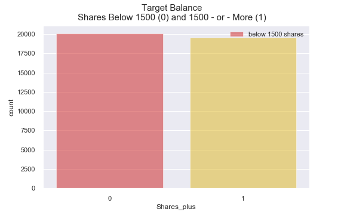
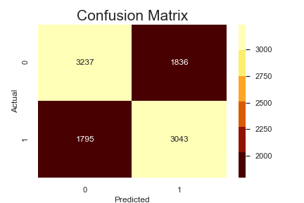
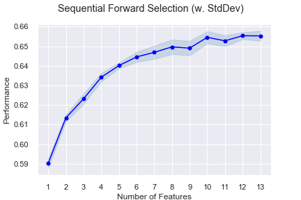

<!-- #region -->

# Module 3 Final Project

## Introduction

The main goal of this project is to create a classification model.

## Objectives

Through this project, I explore the following question:
  * What features are best able to predict how often an online article will be shared?

### Data Set

This dataset was acquired from the University of California, 
Irvine's Center for Machine Learning and Intelligent Systems archive (https://archive.ics.uci.edu/ml/datasets/Online+News+Popularity#).
* Data references articles published by Mashable (www.mashable.com).
* Citation:
  K Fernandes, P Vinagre, P Cortez - Progress in Artificial Intelligence: 17th 
  Portuguese Conference on Artificial Intelligence, EPIA 2015, Coimbra, Portugal, 
  September 8-11, 2015.
  
#### Attribute Information:

Provided data comprises 60 numerical attributes, the first of which being the article url and last of which is the original target value, indicating the number of`shares`.

Other columns provide data regarding the number of words in each article, the content channel within which the article was published, the day of the week the article was published, and other attributes.

### Business Understanding

Mashable is a digital media, news, and blogging website, founded in 2005. It was acquired by Ziff Davis publishing in 2017.

### Data Understanding

To leverage the data for binary classification, I engineered a new `Shares_plus` feature, to indicate whether an article had been shared at least 1500 times.
> The 50th percentile for shares is 1400, so I crafted a conditional for loop to determine a number where I could split the data into two relatively even classes.
* Setting a threshold of 1500 shares resulted in 20,082 articles shared fewer than 1500 times and 19,562 articles shared 1500 times or more.
* Articles shared more than 1500 times were  noted with the number 1, in the engineered column.

### Data Preparation

The dataset's column labels are prefixed with a space character, which I replaced with an empty string. Otherwise, the main cleaning step was an optional choice to shorten a number of labels. I replaced 'entertainment' with 'ent', 'reference' with 'ref', and about a dozen other such customizations, such that an unnecessarily lengthy `weekday_is_friday` label instead became a cleaner `week_fri`.

Visualizing data distributions helped with understanding the types and ranges of data present. Since this was not a regression task, I was not concerned with the apparent lack of strong correlations between the target and any particular predictor. I would leave it to modeling, to make that call.

One thing I did become concerned with was the number of features.

Leaving aside the `url`, which I used only as an index column, there are 59 predictors in the dataset. Since the variables are all numeric, I decided to run an unfit logistic model on the full dataset.

### Modeling

The unfit model proves capable of accurately separating entries into their correct classes 64\% of the time. Following this result with a fitted decision tree model resulted in very similar scoring.

The confusion matrix heatmap shows that the decision tree model slightly favors false negatives over false positives (1836 to 1795). This is a useful result.

### Evaluation

Given the need, we would likely want to favor false negatives over false positives.
* False positives would incorrectly predict high - performing content, potentially causing the content provider to over - charge advertisers and under - deliver content views.
* False negatives could result in over - delivering for advertisers. While this may lessen charges for individual advertisements, it could enhance reputation, favor advertiser ROI, and encourage repeat business.
* Since this is a fairly balanced set of classes, the more accurate the model, the better to deliver or exceed the expectations of advertising algorithms. Results are close enough for accuracy to remain a relevant metric.

__So, why should we look any further?__
* Revenue generated from online content relies on views and user interactions.
    - When content is shared widely, more consumers are likely to have opportunities to view it.
    - Consequently, any advertisements served along with the content has greater exposure.
    - Since online advertising algorithms favor relevant content, __providers of web pages with highly shared content can expect to enjoy revenue from higher advertising rates__.
* The difference in earnings per view is often only a few cents. Those cents add up when we are talking about thousands of views and multiple ad placements per article page.
    - For this reason, it is reasonable to look further.
    - __A model increases our ability to predict shareable content by even just a couple of percentage points could be well worth the effort__.
* In addition, shared content suggest that providers are effectively targeting their key marketing personas with relevant content. That is valuable for brand reputation, __suggests satisfactory user experience__, and encourages repeat visits.

So, at this point, I decided to both look through a different lens and to look more closely.

Random forest is a supervised learning algorithm that performs random sampling with replacement, to essentially fit multiple decision trees. It allows for lower correlation between samples than bagging models, by limiting the number of features on which to split.

> Since random forest leaves out a different segment of the data for testing each tree, it removes bias that can affect single decision tree models. Accordingly, for random forest models, separate cross validation is not required.

However, I chose to scale the data at this point. I was beginning to compare models and to create pipelines that might be used to repeat processes across multiple algorithms. Tree and random forest models may not require scaling, but others might.

This stage also involved creating a grid search dictionary, to use machine learning to tune hyperparameters to find optimal settings for making predictions on our data.

We see a two - percent increase in precision and accuracy, as a result of using GridSearchCV to find optimal parameters for tuning a random forest model, based on the values in our parameter grid.

While model scores remained within only a few percentage points, I wondered whether it would be helpful to reduce the number of features taken into account.

So far, we have been modeling with all features in the dataframe. The random forest classifier suggests 10-or-so relatively important features--a few more than had been suggested by the decision tree model.
* Where kw_avg_avg reached 0.33 and channel_world eeked - out .01 on the scale, for our tree model, random forest model importances for the same two features are approximately 0.15 and .07, respectively.
* Even if the model itself had not improved, we might at least make running the it less computationally expensive.

Here, again, we can let machine learning draw the line.

Including irrelevant features can introduce 'noise' to our model and make results less interpretable. I made use of the mlxtend library's SequentialFeatureSelector (sfs) module to perform forward selection and determine the best features to retain for modeling.

I took my lead from the random forest feature selection visualization, to determine that the sfs module should search for the 'k' most important subset of features in a range between 8 and 13.

Twelve features were found to produce the best predictive scoring model.

* A heatmap of correlations between paired columns in the subset of selected features (_see 'modeling' or 'student' notebook_) reveals relatively strong relationships between the features `n_unique_tokens` and `n_non_stop_words`, and between `self_ref_min_shares` and `self_ref_avg_shares` predictors.
* Since this is a classification project, and since including these features may be necessary to reveal other important in tree based models, I am not concerned with their inclusion.
* In fact:
    - Feature 27 (`self_ref_min_shares`) was added, at fold 11, where the model's score dropped.
    - However, the next fold revealed feature 4 (`n_unique_tokens`), which enhanced the model's score above where it had been prior to adding feature 27.

###  Deployment and Next Steps

The final model was saved as a pickle file, which may be read and applied to future data. Additional steps for operationalizing work product from this project are included in the notebooks.
...

# Featured Notebooks/Analysis

* [`student`: **Jupyter Notebook**](student.ipynb): containing code written for this project and comments explaining it.

* [`obtain and scrub`: **Jupyter Notebook**](01-obtain-and-scrub.ipynb): [notebook segment] Reading, cleaning, and previewing data characteristics and apparent relationships
* [`explore and model`: **Jupyter Notebook**](02-explore-and-model.ipynb): [notebook segment] Visual and exporatory data analysis, modeling, feature selection, hyperperameter tuning, final modeling and summation

#### Visualizations & EDA

* Visualizations, with corresponding interpretations are included within the 'student' and supporting Jupyter notebook(s).

### Non-Technical Presentation

* [presentation.pdf](presentation.pdf) summarizing  methodology and findings

# Technologies
* framework: Jupyter Notebook
* languages: Python
* libraries and modules:
  - Mlxtend SequentialFeatureSelector
  - Numpy
  - OS
  - Pandas
  - Pickle
  - Scikit-Learn:
    * ensemble
    * linear_model
    * metrics
    * model_selection
    * pipeline
    * preprocessing
    * tree
  - XGBoost
  - Yellowbrick classifier
    * DiscriminationThreshold
    * roc_auc
* visualization libraries
  - Matplotlib
  - Seaborn
  - Mlxtend plotting
<!-- #endregion -->

